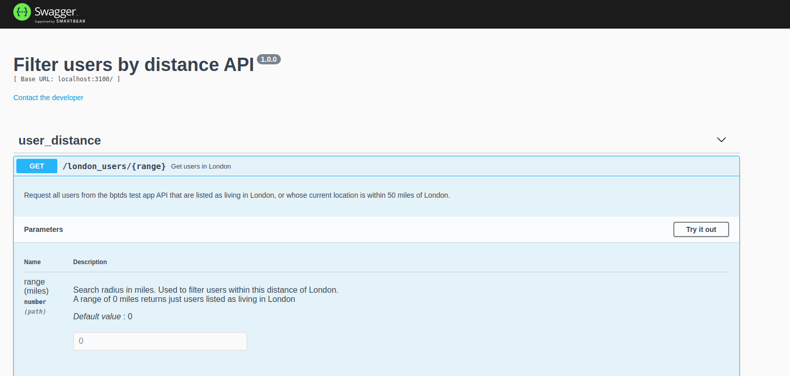

# User Distance API using Node.js, Express.js and TypeScript

Uses the bpdts-test-app API and returns users who are either listed as living in a given city, currently London or Bristol, or whose current location is within a requested number of miles of that city.

The available options are as follows:

```bash
# returns users listed as living in London
http://localhost:3100/london_users/

# returns users listed as living in London and users whose current coordinates 
# are within a requested range (in miles) of that city
http://localhost:3100/london_users/{range}
```


## Running this API locally

- Clone this repository
- Run the following commands from within the cloned repository:

To install dependencies:

```bash
npm install
```

To start the demo:

```bash
npm run start
```

To run the unit tests (with the demo running - use another terminal window):

```
npm run test
```


## Using the Swagger API GUI

In a web browser, navigate to :

```bash
http://localhost:3100/
```

to use the Swagger API (pictured below) to execute calls to the API



## Using this API with Docker

```bash
docker build -t user-distance-api .
```

running the container

```bash
docker run -d --name container_name_1 -p 3100:3100 user-distance-api
```

`--name` should be unique to each instance of run, and can be used to exec commands and kill container later.

Open Web browser at localhost:3100

### Run the tests with PyTest in Docker

```bash
docker exec container_name_1 npm test
```

### To kill the container

If container has not already stopped, run:

```bash
docker kill container_name_1
```
